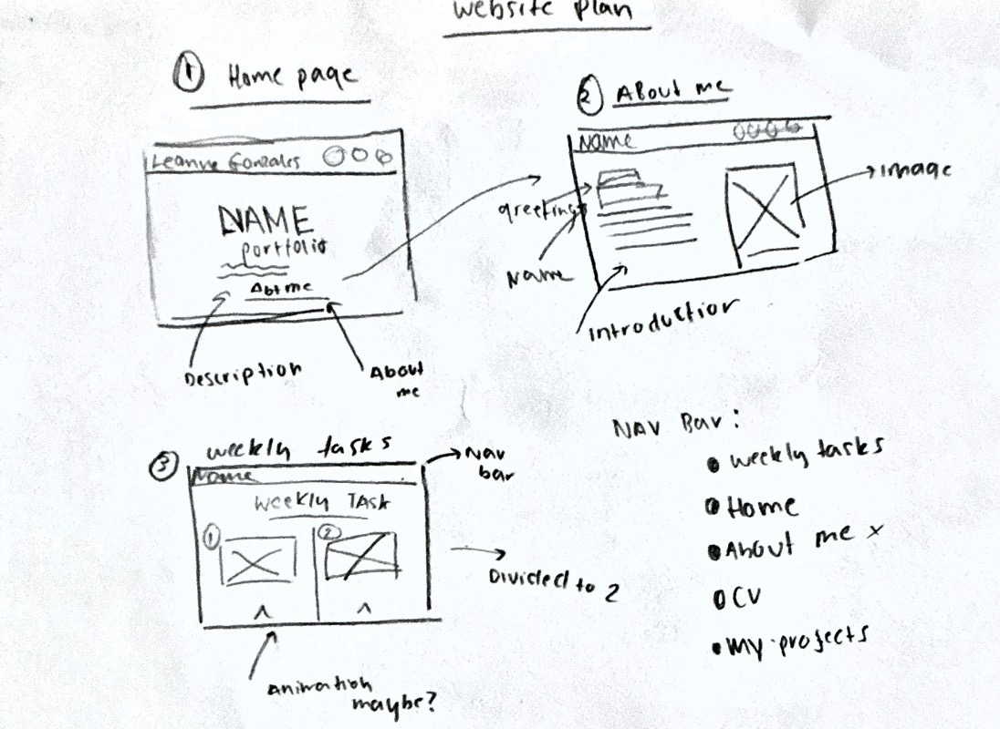

# My Portfolio Website Documentation

## Intro
This project is a personal portfolio website to showcase my weekly tasks and creative work. The website demonstrates my understanding of HTML, CSS, JavaScript, accessibility, and design principles, while also reflecting my interest in digital design and UX/UI within my about me section.

## Features: 
The website includes a simple navigation bar that allows users to move between pages easily. A light and dark theme toggle is included to give users control over the website’s appearance.I structed the weekly tasks in a clean grid layout, making the content easy to view and navigate. In addition, I used the AOS JavaScript library and integrated it to add subtle animations as the user scrolls through the weekly tasks page. This improves the user experience by making the content feel more engaging without affecting usability.

## Design Choices
The design of the website is minimal and clean, focussing on readability and visual balance. I have chosen a warm, muted colour palette to create a calm and consistent aesthetic which I personally really like. For the fonts I have used Inter and Allura.

For the website design plans, I decided to use Figma, which allowed me to prototype layouts. 
*Here's a few that I made*:
 
*Below is the design plan I went with:*
 

## Reflection: 
What I found challenging was integrating JavaScript features without disrupting the layout on the weekly task page. I wasn't sure what exactly was affecting the layout.

To improve this website, I would like to add more detailed project pages, improve mobile responsiveness, and include additional interactive elements to further enhance the user experience.