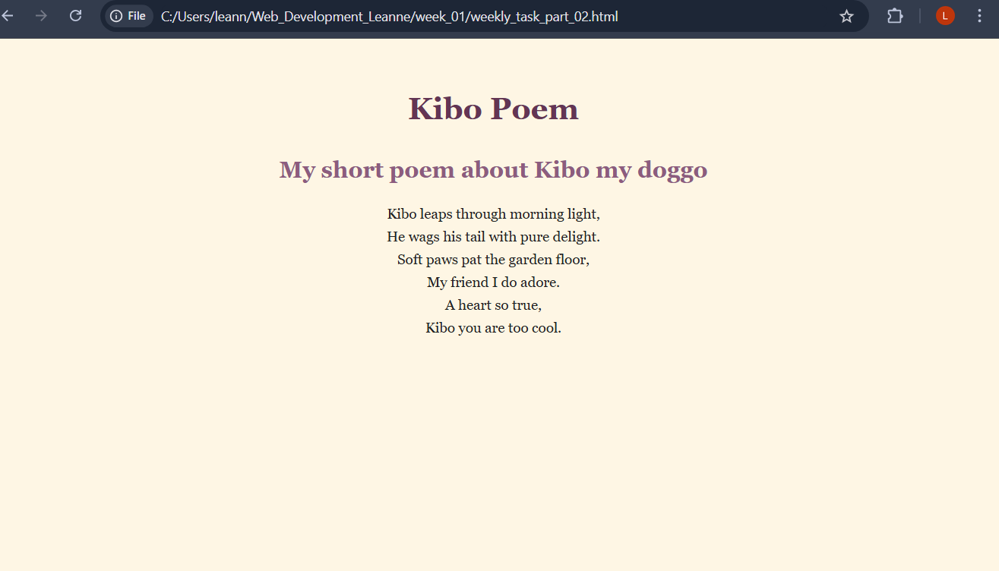
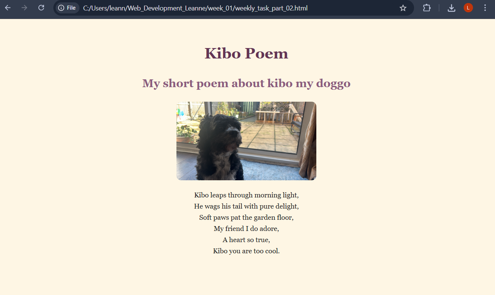
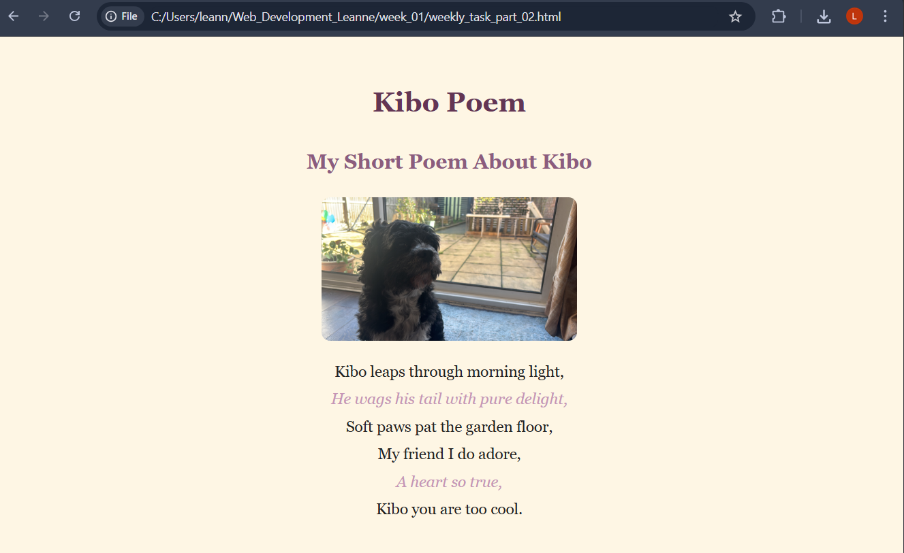
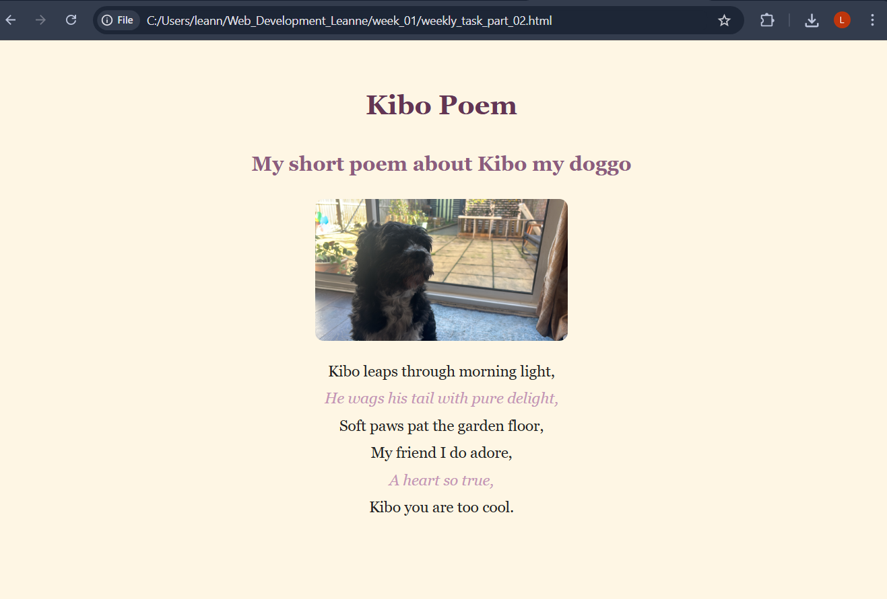

# Documentation - Kibo Poem
*Access site link below:*
https://leatama19.github.io/Web_Development_Leanne/week_01/weekly_task_part_02.html

## Stage 1

- Added a main page heading using h1
- Added the poem inside 'p' tag
- Included background colour/ Font and text colour

## Stage 2

- Adjusted font choice to improve readability
- Centered text for a cleaner layout

## Stage 3

- Added subheading

## Stage 4

- Included an image of my dog and placed it under the subheading

## Stage 5

## Stage 6

