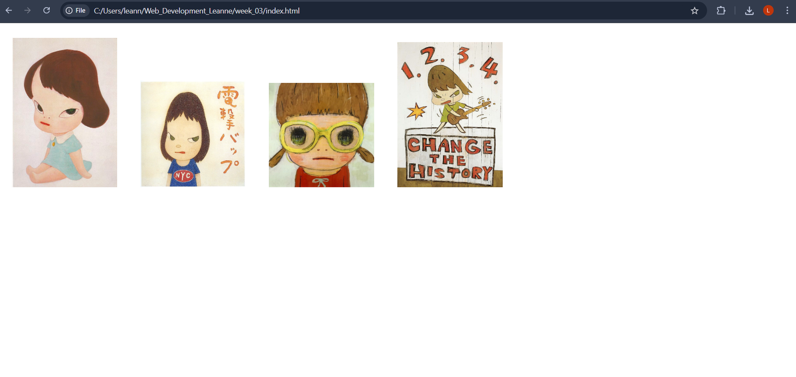

## Weekly Task 3

## Stage 1

- Added 4 images to the page
- Ensured the images were displaying correctly

## Stage 2

- Applied borders to each of the images
- Used padding to create space between the images and the border
- Changed colour of border 

## Stage 3 

- Added background colour
- Experimented with display and layout
- Checking how the different values affect layout and spacing

## Stage 4
https://drive.google.com/file/d/1yCnYlQ9z37S79MBTfgQUTYHr2LPPh3Fv/view?usp=sharing

## Stage 5
https://drive.google.com/file/d/1UQlx20EpGWa2nK5YIBSN-qvcrwnmGDgW/view?usp=sharing
- Added a hover effect to images for interactivity
- When cursor hovers over an image, it pops up smoothly 
- Ensured layout remained responsive when resizing the browser window

## Reflection:
- Center the images to have a more clean layout
- Testing the layout while resizing the browser helped improve responsiveness
