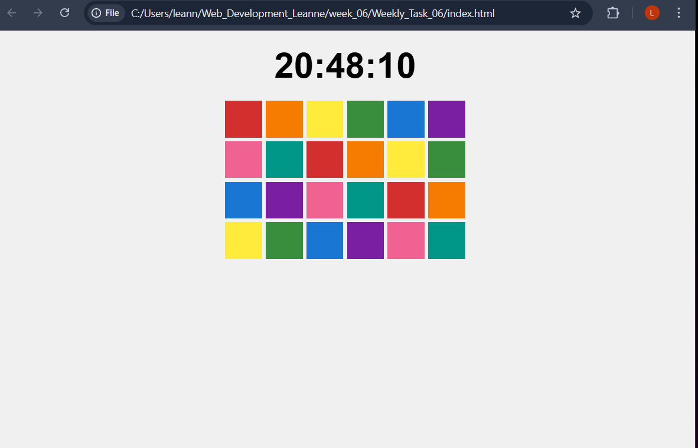

## Weekly Task 06 Documentation
*Access Link at the end to watch screen recording*

## Stage 1

- Focused more on digital elements
- Began with batik inspired pattern

## Stage 2

- Used a for loop to generate 24 individual tiles which represents the hours of the day
Used modulo operator to create a repeating visual pattern

## Stage 3

- real time hours/minutes/seconds
- Displayed at the top of the page

## Stage 4
https://drive.google.com/file/d/13fiGoKdrNQIhGHBSFE0BRpo5u2uQgY19/view?usp=sharing
- Added a CSS trandsition so when tiles appear, they fade in smoothly rather than popping in instantly, I found this part challenging but it worked out in th end

## Reflection
- I enjoyed using the concept of Batik and transforming it into a digital animation
- I liked the fade in animation of the tiles
- I found balancing the opacity and transtition timing quite challenging (the fade in)
- To improve maybe make the design more responsive 
- Add customixation and try out different patterns and shapes