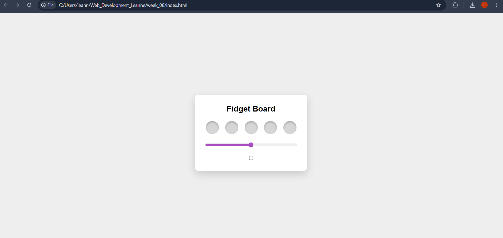
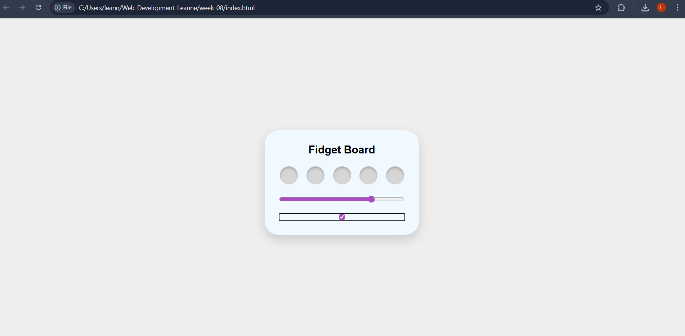

## Weekly Task 08 Documentation
*Access links for screen recording*

## Sketch Plan
 

## Stage 1

Link: https://drive.google.com/file/d/1scB_nS4PbfafxhLIJiW_pzBkbXpkAJfj/view?usp=sharing
- Explored basic HTML form elements
- Mainly focused on default appearance and see how it worked
- Focused on checkboxes and sliders prior to styling

## Stage 2

Link: https://drive.google.com/file/d/1nWbiKuSNrNiJjxroY3_u2-_F0tLDUBJh/view?usp=sharing
- Focused on layout, spacing and visual grouping
- Added rounded corners/ shadows to the white box
- I aimed to go with an actual inspired fidget board for visual

## Stage 3
 
 Link: https://drive.google.com/file/d/1hX8C9vkYM_YbgBoDohFBJHIEkoFlb0qq/view?usp=sharing 
 -Restyled checkboxes as circles to resemble pop-it elements
 - Used CSS to provide visual feedback when pressed
 - Turns to a blue colour when pressed
 - Kept sliding mechanism the same

 ## Stage 4
 
 https://drive.google.com/file/d/12Yldyu-VK8lmPQp77WSDmF8OOY8cMro3/view?usp=sharing 
- Introduced JavaScript
- The slider and toggle inputs modify the board's shape and color in real time
- Focused more on interaction 

 ## Stage 5
 
 https://drive.google.com/file/d/1bFYOhrkKRqsouFtmzh-0t0nJNcv0JeUM/view?usp=sharing
 - Integrates interaction and motion into the fidget board
 - When switch is pressed, the 'fidget board' shakes 
 - This can be turned off when clicked again
 - Improved the visual of the checkboxes
 
 ## Reflection
 Overall, this project was very fun to make and experiment. I ran into some challenges when styling inputs and making sure the interactions responded correctly. 
 
 If I were to continue developing it, I would add more fidget-style interactions and experiment with color, since the current design feels a bit visually bland. I would also focus more on balancing visual styling with interactivity to make the experience more engaging overall.